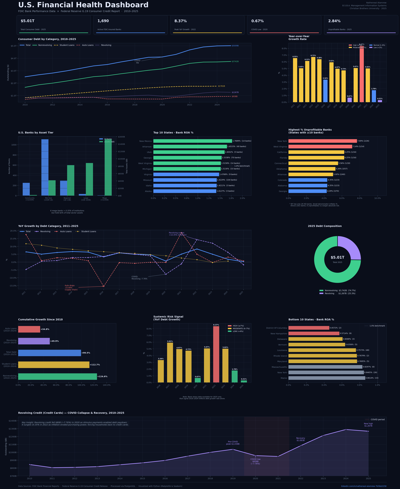

# U.S. Financial Health Dashboard

Analysis of U.S. consumer debt trends and FDIC bank performance (2010–2025) using PostgreSQL, Python, Matplotlib, and Seaborn. Built from Federal Reserve G.19 and FDIC public datasets.



---

## Overview

This project analyzes two interconnected dimensions of U.S. financial health:

1. **Consumer Debt Trends** — $5.01T in outstanding consumer credit across revolving, nonrevolving, auto, and student loan categories tracked from 2010 to 2025 using Federal Reserve G.19 data.
2. **Banking Sector Health** — FDIC-reported performance data across 1,690 active U.S. banks, including return on assets by state, asset concentration by tier, and unprofitable bank distributions.

The analysis was designed to answer one core question: **are American consumers and the banks that serve them becoming more or less financially stressed over time?**

---

## Key Findings

- **Total consumer debt grew 99.5%** from $2.51T in 2010 to $5.01T in 2025 — nearly doubling in 15 years
- **2022 posted the highest YoY growth rate** at 8.37%, driven by a 14.35% surge in revolving credit as inflation forced households onto credit cards
- **2020 was the COVID anomaly** — debt growth nearly flatlined at 0.67% as stimulus payments allowed consumers to pay down balances; revolving credit fell 7.76%
- **Nonrevolving debt grew the fastest** overall at 124.6% since 2010, reflecting the long-term rise in student and auto financing
- **Student loan debt grew 112.7%** (2010–2024), making it the defining debt story of the past decade
- **6 mega banks hold 41.6% of total sector assets** despite representing just 0.36% of all institutions — a structural concentration risk
- **New Mexico leads in bank profitability** with a 1.77% return on assets; District of Columbia sits lowest at 0.46%
- **New York has the highest % of unprofitable banks** at 7.69%, though with only 26 HQ banks the small denominator inflates the figure; Illinois (161 banks, 6 unprofitable) represents a larger absolute concern

---

## Tools & Technologies

| Tool | Purpose |
|---|---|
| **PostgreSQL** | Data storage, cleaning, and SQL analysis |
| **Python 3** | Data processing and visualization |
| **Pandas** | Data manipulation and transformation |
| **Matplotlib** | Chart construction and layout |
| **Seaborn** | Statistical styling |
| **pgAdmin 4** | PostgreSQL GUI and CSV export |

---

## Data Sources

| Dataset | Source | Series |
|---|---|---|
| Total Consumer Credit | Federal Reserve FRED | TOTALNS |
| Revolving Credit | Federal Reserve FRED | REVOLNS |
| Nonrevolving Credit | Federal Reserve FRED | NONREVNS |
| Auto Loans | Federal Reserve FRED | DTCTHFNM |
| Student Loans | Federal Reserve FRED | SLOAS |
| Bank Performance | FDIC Bank Data API | Institutions + Financials |

All data is publicly available and free to access.

---

## SQL Concepts Used

This project demonstrates progression from basic to advanced SQL:

**Foundational**
- `SELECT`, `WHERE`, `GROUP BY`, `HAVING`, `ORDER BY`
- Aggregate functions: `SUM`, `AVG`, `COUNT`, `MIN`, `MAX`
- `CASE WHEN` conditional logic
- `NULLIF` for safe division, `COALESCE` for null handling

**Intermediate**
- `INNER JOIN` and `LEFT JOIN` across multiple tables
- Subqueries inside `JOIN` clauses
- Multi-table analysis and data reconciliation

**Advanced**
- CTEs (`WITH` statements) and stacked CTEs
- Window functions: `LAG()`, `RANK()`, `SUM() OVER()`, `PARTITION BY`
- Year-over-year growth rate calculations
- Rolling averages with `ROWS BETWEEN`
- `UNION ALL` for reshaping wide data into long format

---

## Project Structure

```
us-financial-health-dashboard/
│
├── dashboard.py                          # Main Python visualization script
├── us_financial_analysis_clean.sql       # All 16 SQL queries
│
├── data/
│   ├── bank_roa_by_state.csv            # FDIC: Return on assets by state
│   ├── bank_tier_distribution.csv       # FDIC: Banks by asset tier
│   ├── unprofitable_banks_by_state.csv  # FDIC: Unprofitable bank % by state
│   ├── consumer_debt_yoy.csv            # Fed: Consumer debt with YoY growth
│   └── capstone_risk_signal.csv         # Combined risk signal by year
│
└── Natheneal_Alamrew_Financial_Dashboard.png  # Final dashboard output
```

---

## How to Run

**1. Clone the repository**
```bash
git clone https://github.com/natheneal-alamrew/us-financial-health-dashboard.git
cd us-financial-health-dashboard
```

**2. Install dependencies**
```bash
pip install matplotlib seaborn pandas numpy
```

**3. Run the dashboard script**
```bash
python3 dashboard.py
```

The script reads from the CSV files in the `data/` folder and outputs `Natheneal_Alamrew_Financial_Dashboard.png` in the root directory.

**4. To reproduce the SQL analysis**

- Install PostgreSQL and pgAdmin 4
- Create a database called `us_financial_analysis`
- Download the raw FRED series CSVs from [fred.stlouisfed.org](https://fred.stlouisfed.org)
- Import them using the table setup at the top of `us_financial_analysis_clean.sql`
- Run the queries in order — each builds on the previous

---

## Dashboard Sections

| Section | Charts | Data Source |
|---|---|---|
| Consumer Debt Trends | Multi-line trend · YoY growth bars | Federal Reserve |
| Debt Composition | Donut chart · Cumulative growth bars | Federal Reserve |
| Category Breakdown | YoY by category 2011–2025 | Federal Reserve |
| Banking Sector | Tier distribution · State ROA map table | FDIC |
| Risk Analysis | Top/bottom ROA states · Unprofitable banks | FDIC |
| Capstone | Systemic risk signal 2016–2025 | Combined |
| Deep Dive | Revolving credit COVID collapse & recovery | Federal Reserve |

---

## Data Notes

- Consumer debt figures are reported in millions by the Federal Reserve; all values in this project are converted to billions for readability
- The consumer debt YoY data includes partial-year 2025 figures; student loan data ends at 2024 due to reporting lag
- FDIC bank data reflects institutions **headquartered** in each state, not branch locations — this explains why states like New York show fewer banks than expected
- The 2022 risk signal is classified as HIGH in the visualization (8.37% YoY growth) vs. MODERATE in the raw SQL output; the reclassification reflects the fact that 8.37% is the highest rate in the entire dataset and warrants elevated classification
- Bank stress indicators (ROA, unprofitable bank %) were available only for the 2025 reporting period in the FDIC dataset used; risk signals for 2016–2024 reflect consumer debt growth rate alone

---

## About

**Natheneal Alamrew**
B.S.B.A., Concentration in Management Information Systems
Minor in Business Analytics
Christian Brothers University — December 2025

[LinkedIn](https://www.linkedin.com/in/natheneal-alamrew-7b58a5258/) · [GitHub](https://github.com/natheneal-alamrew)
